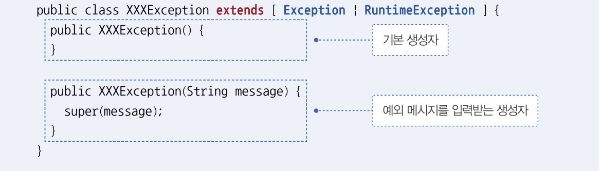

# 예외처리
* 컴퓨터 하드웨어의 고장으로 응용프로그램 실행 오류가 발생하는 것을 에러라고 한다.
* 그리고 에러 이외에 예외라고 부르는 오류가 있다.
* 예외란 잘못된 사용 또느느 코딩으로인한 오류를 말한다.
* 예외가 발생하면 예외처리를 통해 계속 실행 상태를 유지할 수 있다.
    + 예외는 두가지가 있다.
      + 일반 예외 : 컴파일러가 예외 처리 코드 여부를 검사하는 예외
      + 실행 예외 : 컴파일러가 예외 처리 코드 여부를 검사하지 않는 예외

* 자바는 예외가 발생하면 예외 클레스로부터 객체를 생성하고 예외 처리시 사용한다.

### 예외 처리 코드
> 예외가 발생했을 때 프로그램의 갑작스러운 종료를 막고 정상 실행을 유지할 수 있도록 처리하는 코드
* 예외처리 코드는 tye-catch-finally 블록으로 구성된다. (생성자 내부와 메소드 내부에서 작성된다.)

* 예외가 발생한 경우 catch 블럭이 실행된다. finally 블록은 예외에 상관없이 항상 실행된다.

### 예외 종류에 따른 처리
* try 블록에는 다양한 종류의 예외가 발생할 수 있다.
* 다중 cattch를 사용하면 발생하는 예외에 따라 얘외 처리 코드를 다르게 작성할 수 있다.
* 해당 타입의 예외가 발생하면 catch 블록이 선택되어 실행된다.

## 리소스 자동 닫기
> 리소스란 데이터를 제공하는 객체이다.
* 리소스를 사용하기 위해 열고 사용이 끝난 뒤 닫아야한다.
* 리소스를 사용하다가 예외가 발생한 경우에도 안전하게 닫아야한다. 그렇지 않으면 리소스가 불안정한 상태로 남아있게 된다.
* finally 코드에 .close(); 를 작성하면 해당 블록에서 안전하게 close한다.
* 더 쉬운 방법으론는 try-with-resource 블록을 사용하는 것이다. 예외 발생 여부와 상관없이 리소스를 자동으로 닫아준다.

### 예외 떠넘기기
- 메소드 내부에 예외가 발생할 때 try-catch 블록으로 예외처리하는 게 기본이지만 메소드를 호출한 곳으로 예외를 떠넘길 수도 있다.
> 리턴타입 메소드명(매개변수, ...) **throws** 예외클래스1, 예외클래스2 ... { }
* throws 키워드가 붙은 메소드에서 예외를 처리하지 않고 넘겼기 때문에 이 메소드를 호출하는 곳에서 처리해야한다.

### 사용자 정의 예외
> 직접 예외클래스를 정의하여 사용하는 예외
* 일반 예외는 Exception의 자식클래스로 선언
* 실행 예외는 RuntimeException의 자식클래스로 선언한다.
